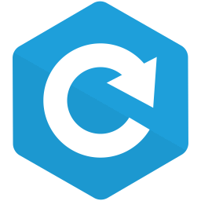

> This repository is in maintainance mode. Bug fixes will be provided on a best effort basis. If you use this project, please consider contributing back.

#  nw-dev

A drop-in library for [nw.js][] development

* Live-reloads upon save

* Reloads when you press <kbd>F5</kbd>

* Opens the devtools when you press <kbd>F12</kbd> (`nw@>=0.13.0` does this for you)

* Opens the devtools upon error

* Sets `window.CRASHED` upon error,
  so you can stop an animation loop for example
  (and not flood the console with errors)

* Clears the require cache,
  so reloading works with modules

* When you change `package.json`, it closes and reopens the window
  with the new values, so you don't even have to restart
  to change things like `window.frame`
  (not working in latest nw.js)

* When loaded in a browser (non-nw.js),
  it only tries to do error handling


## Install

`npm i nw-dev --save-dev`

Put this script before any other scripts
(or at least ones you're developing):

```html
<script src="node_modules/nw-dev/lib/dev.js"></script>
```


## Exclude some files from being watched

By default `node_modules`, `npm-debug.log`, `.git`, `.hg`, and `.svn` are ignored.

You can ignore additional paths by adding a `data-ignore` attribute to the script:

```html
<script src="node_modules/nw-dev/lib/dev.js" data-ignore="data.json|*.md"></script>
```

The ignore pattern will be passed to [chokidar][] and interpreted by [micromatch][].


## Usage with `win.show()`

If you use `win.show()` to show your app's window only once it finishes loading,
it may also *focus* the window, depending on the platform.

This can be annoying if you want to keep editing after saving, as it will steal focus from your code editor — especially if you use autosave.

To avoid this behavior, you can guard against calling `win.show()` more than once like so:

```js
if(!win.shown){
    win.show();
    win.shown = true;
}
```

Note that `win.shown` is a made-up property (using Javascript's [expando](https://developer.mozilla.org/en-US/docs/Glossary/Expando) feature), but it's attached to the NW.js window object rather than using a simple global variable, in order to persist across reloads.

## Develop nw-dev

* `npm i`

* `npm link`, and `npm link nw-dev` from an nw.js project

* `npm run prepublish` to recompile

[nw.js]: https://github.com/nwjs/nw.js
[chokidar]: https://github.com/paulmillr/chokidar
[micromatch]: https://github.com/jonschlinkert/micromatch
